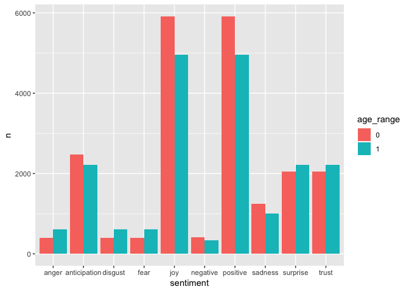
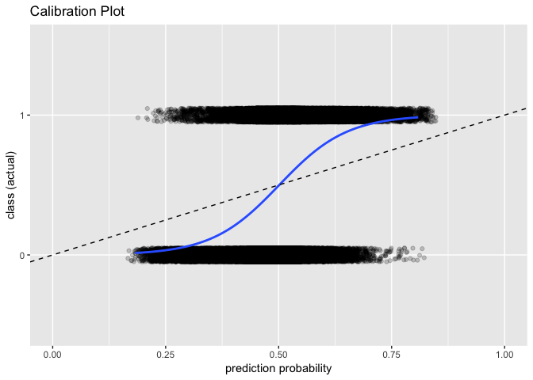

Intro & Install:
----------------

The `wordly` package provides functions for NLP analysis and modeling. It is mainly a driver for existing libs such as text2vec, tokenizers, xgboost, etc.

Install:

``` r
devtools::install_github("tomathon-io/wordly")
```


Tokenization & Sentiment:
-------------------------

In this example we will be using the **profiles** data set from the `okcupiddata` package. This data set is a collection of OKCupid profiles, structured in the following manner:

``` r
okcupiddata::profiles %>% 
  head(2) %>% 
  knitr::kable()
```

|  age| body\_type     | diet              | drinks   | drugs     | education                     | ethnicity    |  height|  income| job                  | last\_online        | location                        | offspring                              | orientation | pets                      | religion                                 | sex | sign   | smokes    | speaks                                                | status | essay0                                                                                                                                   |
|----:|:---------------|:------------------|:---------|:----------|:------------------------------|:-------------|-------:|-------:|:---------------------|:--------------------|:--------------------------------|:---------------------------------------|:------------|:--------------------------|:-----------------------------------------|:----|:-------|:----------|:------------------------------------------------------|:-------|:-----------------------------------------------------------------------------------------------------------------------------------------|
|   22| a little extra | strictly anything | socially | never     | working on college/university | asian, white |      75|      NA| transportation       | 2012-06-28 20:30:00 | south san francisco, california | doesn't have kids, but might want them | straight    | likes dogs and likes cats | agnosticism and very serious about it    | m   | gemini | sometimes | english                                               | single | about me: i would love to think that i was some some kind of intellectual: either the dumbest smart guy, or the smartest dumb guy. can't |
|   35| average        | mostly other      | often    | sometimes | working on space camp         | white        |      70|   80000| hospitality / travel | 2012-06-29 21:41:00 | oakland, california             | doesn't have kids, but might want them | straight    | likes dogs and likes cats | agnosticism but not too serious about it | m   | cancer | no        | english (fluently), spanish (poorly), french (poorly) | single | i am a chef: this is what that means. 1. i am a workaholic. 2. i love to cook regardless of whether i am at work. 3. i love to drink and |

For our purposes, we will focus on the *essay* and *age* variables of the data set. Here we extract those variables, and convert the *age* variable to an *age\_range* binary variable, based on the median-age cutoff of 30:

``` r
summary(okcupiddata::profiles$age)
```

    ##    Min. 1st Qu.  Median    Mean 3rd Qu.    Max. 
    ##   18.00   26.00   30.00   32.34   37.00  110.00

``` r
okc_data <- okcupiddata::profiles %>% 
  filter(!is.na(age) & !is.na(essay0)) %>% 
  mutate(id = 1:nrow(.)) %>% 
  mutate(age_range = ifelse(.$age <= 30, 0, 1)) %>% 
  select(id, age_range, essay = essay0)

okc_data %>% 
  head(2) %>% 
  knitr::kable()
```

|   id|  age\_range| essay                                                                                                                                    |
|----:|-----------:|:-----------------------------------------------------------------------------------------------------------------------------------------|
|    1|           0| about me: i would love to think that i was some some kind of intellectual: either the dumbest smart guy, or the smartest dumb guy. can't |
|    2|           1| i am a chef: this is what that means. 1. i am a workaholic. 2. i love to cook regardless of whether i am at work. 3. i love to drink and |

We can start by tokenizing the *essay* variable. To do this, we simply use the `token_eyes()` function from our `wordly` package, providing it thhe name of the variable to be tokenized, in this case *essay*:

``` r
okc_tokens <- okc_data %>% 
  token_eyes("essay")

okc_tokens %>% 
  head(5) %>% 
  knitr::kable()
```

|   id|  age\_range| word  |
|----:|-----------:|:------|
|    1|           0| about |
|    1|           0| me    |
|    1|           0| i     |
|    1|           0| would |
|    1|           0| love  |

Oops, looks like we forgot to remove stop words. That's ok, wordly's `token_eyes()` function makes it easy to remove stop words by providing either a stop word source list, or a custom list of stop words using `stop_word_src = c("my", "custom", "stopword", "list")`.

For this example, we will use the **"smart"** stop word source list:

``` r
okc_tokens <- okc_data %>% 
  token_eyes("essay", stop_word_src = "smart")

okc_tokens %>% 
  head(5) %>% 
  knitr::kable()
```

|   id|  age\_range| word         |
|----:|-----------:|:-------------|
|    1|           0| love         |
|    1|           0| kind         |
|    1|           0| intellectual |
|    1|           0| dumbest      |
|    1|           0| smart        |

Actually, since our whole purpose was to extract sentiment from our data, we will run the `token_eyes()` function one last time, and this time we will tell it to provide sentiment analysis using the 'NRC' sentiment source:

``` r
okc_sentiment_nrc <- okc_data %>% 
  token_eyes(
    # the variable name to be tokenized:
    text_col_name = "essay",
    # using the "smart" stop word source list:
    stop_word_src = "smart",
    # using the "nrc" sentiment source:
    sentiment_src = "nrc"     
  )


okc_sentiment_nrc %>% 
  head(5) %>% 
  knitr::kable()
```

|   id|  age\_range| word | sentiment |
|----:|-----------:|:-----|:----------|
|    1|           0| love | joy       |
|    1|           0| love | positive  |
|    1|           0| kind | joy       |
|    1|           0| kind | positive  |
|    1|           0| kind | trust     |

Neat! Looks like we got the sentiment output that we were after.

Now we can get a visual representation of our sentiment output using ggplot2:

``` r
okc_sentiment_nrc %>% 
  filter(sentiment != "<NA>") %>% 
  mutate(age_range = factor(age_range)) %>% 
  group_by(age_range) %>% 
  count(word, sentiment, sort = TRUE) %>% 
  ggplot(aes(x = sentiment, y = n, group = age_range, fill = age_range)) +
  geom_bar(stat = 'identity', position = 'dodge')
```



NLP Modeling:
-------------

Along with tokenization and sentiment, the `wordly` package provides functions used in **NLP modeling and prediction**.

**IMDB MOVIE REVIEWS:**

For our example we will use pre-build **train and test** data sets created from **IMDB movie review data**.

``` r
dim(train_)
```

    ## [1] 307200      2

``` r
dim(test_)
```

    ## [1] 96000     2

The data sets themselves contain a *Freshness* binary (0,1) rating variable, and a user-input free text *Review* variable:

``` r
train_ %>% 
  head(5) %>% 
  knitr::kable()
```

|        |  Freshness| Review                                                                                                                                                                                                                                                |
|--------|----------:|:------------------------------------------------------------------------------------------------------------------------------------------------------------------------------------------------------------------------------------------------------|
| 427313 |          0| True, the general audiences doesn't need hours of complex biochemistry talk they won't understand, but surely there's a better way of getting around it than showing Ford sitting in a lab coat writing on a dry erase board to rock music.           |
| 310217 |          0| No wonder The Black Dahlia has the suffocated tint of a face starved for oxygen -- this isn't film noir, it's film bleu.                                                                                                                              |
| 474049 |          1| Salt is like a swell summer day at the movies back in 1984, when flicks knew how to do action and dudes named Vladimir had trouble boarding a Delta flight from New York to Washington.                                                               |
| 476023 |          1| Leticia and Hank come together in their grief, and when they do - when, in particular, they seek some kind of punishment and absolution in sex - it makes for one of the most intense, moving and real moments you're ever likely to witness on film. |
| 406627 |          1| For those willing to risk a close encounter with this maverick, there are undoubtedly rewards to be found in Climax.                                                                                                                                  |

**MODELING:**

A good first step to any NLP modeling pipeline is to create a **Document-Term Matrix (DTM)** from the data sets. This is easily accomplished using wordly's `prepare_dtm()` function.

Wordly's `prepare_dtm()` function includes the ability to:

-   return a **vectorizer** object (imperative when working with Training Data)
-   provide a **stop word list** (optional)
-   define the **n-gram length** of each token when creating a DTM (defaults to 1)
-   return **informative verbose info** to user to confirm dealing with **Train** or **Test** data

So, as a first step, we create a **Train DTM**. Note that we set `return_vectorizer = TRUE` when dealing with Training Data, which outputs both our **Train DTM** and our **vectorizer**, which we will use later when creating our **Test DTM**:

``` r
dtm_train_vect <- train_ %>% 
  prepare_dtm(
    # the text column name:
    text_col_name = "Review",
    # the stop word list:
    stopword_list = tidytext::get_stopwords()$"word",
    # TRUE for Train data:
    return_vectorizer = TRUE
  )
```

    ## 
    ## Creating Iterator...
    ## No vectorizer provided (this is most likely Training data).
    ## 
    ## Creating Vectorizer...
    ## Creating DTM object...
    ## 
    ## Returning dtm object and vectorizer.

``` r
# Extract the Train DTM:
dtm_train <- dtm_train_vect$"dtm_obj"
# Extract the vectorizer:
vectorizer_train <- dtm_train_vect$"vectorizer_out"
```

Next, we create the **Test DTM**. Note that when working with Testing Data, we leave the default `return_vectorizer = FALSE` and we provide the **vectorizer\_train** object from above to the **use\_vectorizer** argument with `use_vectorizer = vectorizer_train`:

``` r
dtm_test <- test_ %>% 
  prepare_dtm(
    # the text column name:
    text_col_name = "Review",
    # provided train vectorizer:
    use_vectorizer = vectorizer_train
  )
```

    ## 
    ## Creating Iterator...
    ## Using provided vectorizer (this is most likely Test data).
    ## Creating DTM object...
    ## 
    ## Returning dtm object only.

Finally, we can model our data. For this purpose, the `wordly` package contains the `prepare_xgboost_model` function, an intuitive and easy-to-use driver for creating **xgboost** models from NLP data.

Four this example, our `prepare_xgboost_model` function can be called like so:

``` r
xgb_model <- prepare_xgboost_model(
  # the original Train data:
  train_data = train_, 
  # the created Train DTM:
  dtm_train_data = dtm_train, 
  # the response column name:
  response_label_name = "Freshness",
  # when modeling binary response:
  xgb_objective = "binary:logistic",
  # n rounds (defaults to 100):
  xgb_nrounds = 10
)
```

    ## [1]  train-error:0.425007 
    ## Will train until train_error hasn't improved in 5 rounds.
    ## 
    ## [2]  train-error:0.417835 
    ## [3]  train-error:0.405719 
    ## [4]  train-error:0.396963 
    ## [5]  train-error:0.395563 
    ## [6]  train-error:0.390023 
    ## [7]  train-error:0.377591 
    ## [8]  train-error:0.374857 
    ## [9]  train-error:0.368831 
    ## [10] train-error:0.364779

Once the data has been modeled we can look at a **Calibration Plot**:

``` r
pred_prob <- predict(xgb_model, dtm_test)

tibble(
  actual = test_$"Freshness",
  pred_prob = pred_prob
) %>%
  arrange(pred_prob) %>%
  ggplot(aes(x = pred_prob, y = actual)) +
  geom_jitter(alpha = 0.2, width = 0.05, height = 0.05) +
  xlim(0, 1) +
  scale_y_discrete(limits = c(0, 1)) +
  stat_smooth(method = 'glm', se = FALSE,
              method.args = list(family = binomial)) +
  geom_abline(linetype = "dashed") +
  labs(title = "Calibration Plot",
       x = "prediction probability",
       y = "class (actual)")
```


